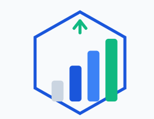

<div align="center">



# 💼 Investment Hub

**A collaborative investment platform where investors pool money and entrepreneurs raise capital — with group investing, verified identities and legally documented deals.**


</div>

---

## 📖 Overview

Investment Hub is a full-stack web application built for the Bangladeshi investment ecosystem. It connects two sides of the market:

| 👤 **Investors** | 🏢 **Businessmen / Entrepreneurs** |
|---|---|
| Discover funding opportunities | Raise capital for a company |
| Invest individually or through a group | Publish investment ads with profit terms |
| Create & manage investment groups | Review and accept funding requests |
| Follow the newsfeed and company insights | Track deals, funding progress and feedback |

Every signup is verified against a **National ID (NID)** through a dedicated micro-service, deals are backed by **auto-generated PDF contracts**, and all sessions are secured with **httpOnly cookie-based authentication**.

---

## ✨ Key Features

- **🔑 Dual-role authentication** — investor & businessman sign-up/login with bcrypt-hashed passwords, server-side sessions and an httpOnly `sid` cookie (7-day expiry, single-session policy).
- **🪪 NID verification** — a separate `NID_server` micro-service validates National ID numbers before an account can be created.
- **📢 Investment ads** — businessmen publish fundraising campaigns (amount needed, pitch, sales history, profit %, deadline, thumbnail); investors browse them in a searchable deal marketplace.
- **🤝 Deal pipeline** — request → review → accept. Accepting one request automatically rejects the rest, creates the deal records and marks the ad as `funded`.
- **👥 Investment groups** — investors create groups, invite members via join requests, and opt **in/out** of group investment offers with per-participant tracking.
- **📄 PDF contracts** — downloadable, legally formatted contracts generated client-side with jsPDF for every deal.
- **📰 Newsfeed** — public and group-private posts with images, visibility badges and likes.
- **🏢 Company directory** — company profiles, stats and "your company" dashboards for businessmen.
- **⭐ Deal feedback** — structured feedback per deal, submitted by either party.
- **👤 Profiles** — portfolio, joined groups, investment history and account insights.
- **🛡️ Role-based UI** — routes and navigation adapt per role; unauthorized access renders a styled 404/access-denied screen.
- **🎨 Polished UI** — animated hero sections, smooth Lenis scrolling, framer-motion transitions, marquee testimonials and a responsive dark pill navbar.

---

## 🏗️ Architecture

```
                       ┌──────────────────────────────┐
                       │        Browser (Vite)        │
                       │   http://localhost:5173      │
                       └──────────────┬───────────────┘
                                      │  fetch (credentials: include)
                                      │
              ┌───────────────────────┼───────────────────────┐
              │                       │                       │
              ▼                       ▼                       ▼
┌─────────────────────────┐ ┌───────────────────┐ ┌─────────────────────────┐
│  🖥️  Front_end :5173    │ │ 🖥️ Back_end :5009 │ │ 🖥️ NID_server :5010     │
│  React SPA              │─▶  Express REST API  │ │  NID verification       │
│  Redux Toolkit          │ │  Session auth      │ │  micro-service          │
│  Tailwind + HeroUI      │ │  Multer uploads    │ └───────────┬─────────────┘
└─────────────────────────┘ └──────────┬──────────┘             │
                                       │                        │
                                       └───────────┬────────────┘
                                                   ▼
                                       ┌───────────────────────┐
                                       │   MySQL  (3306)       │
                                       │   investment_hub DB   │
                                       └───────────────────────┘
```

| Service | Folder | Port | Purpose |
|---|---|---|---|
| **Frontend** | `Front_end/` | `5173` | React single-page application (Vite dev server) |
| **API Server** | `Back_end/` | `5009` | REST API, auth, uploads, MySQL access |
| **NID Server** | `NID_server/` | `5010` | National ID verification service |

---

## 🛠️ Tech Stack

| Layer | Technologies |
|---|---|
| **Frontend** | React 18, React Router v7, Redux Toolkit, Vite 7, Tailwind CSS v4 (CSS-first config), HeroUI, Framer Motion, Lenis, lucide-react, jsPDF |
| **Backend** | Node.js, Express 5, express-validator, bcrypt, Multer, cookie-parser, CORS, mysql2 (pool), Nodemon |
| **Database** | MySQL 8 — schema in `Back_end/Investment_hub.sql` |
| **Tooling** | ESLint (flat config), npm, Git |

---

## 🚀 Getting Started

### 📋 Prerequisites

- **Node.js** ≥ 18 and npm
- **MySQL** ≥ 8 running locally (or a remote instance)
- A Git client

### 1️⃣ Clone the repository

```bash
git clone https://github.com/<your-username>/Investment-Hub.git
cd Investment-Hub
```

### 2️⃣ Create the database

```bash
mysql -u root -p < Back_end/Investment_hub.sql
```

Then seed the NID table (creates `nid_table` and inserts 25 sample records):

```bash
cd NID_server
node setup_nid.js
cd ..
```

### 3️⃣ Configure environment variables

Both API services read the same six variables — copy the examples and fill in your credentials:

```bash
cp Back_end/.env.example    Back_end/.env
cp NID_server/.env.example  NID_server/.env
```

```env
DB_HOST=localhost
DB_PORT=3306
DB_USER=root
DB_PASSWORD=your_password
DB_NAME=investment_hub
DB_CONNECTION_LIMIT=10
```

> ⚠️ `.env` files are git-ignored — never commit real credentials. Only `.env.example` is tracked.

### 4️⃣ Install dependencies

```bash
npm install --prefix Front_end
npm install --prefix Back_end
npm install --prefix NID_server
```

### 5️⃣ Run the application (3 terminals)

```bash
# Terminal 1 — API server  ➜  http://localhost:5009
npm start --prefix Back_end

# Terminal 2 — NID service ➜  http://localhost:5010
node NID_server/server.js

# Terminal 3 — Frontend   ➜  http://localhost:5173
npm run dev --prefix Front_end
```

Open **http://localhost:5173** in your browser — you should see the landing page, with the API health page at **http://localhost:5009/**.

---

## 📁 Project Structure

```
Investment-Hub/
│
├── Front_end/                  # React SPA (Vite + Tailwind v4 + HeroUI)
│   ├── public/                 # Images, logos, static assets
│   ├── src/
│   │   ├── components/
│   │   │   ├── Home/           # Landing page sections (Hero, Steps, Reviews…)
│   │   │   ├── About/          # About page content
│   │   │   ├── Auth/           # Login & multi-step SignUp (with NID check)
│   │   │   ├── Deals/          # Deal marketplace, request list, PDF contract
│   │   │   ├── Groups,companise/  # Groups & companies browsing/management
│   │   │   ├── Investment/     # "Seek investment" ad publishing form
│   │   │   ├── Newsfeed/       # Posts, composer, likes
│   │   │   ├── Profile/        # Profile hero, portfolio, joined groups
│   │   │   ├── Visit/          # Group detail page & group investment posts
│   │   │   ├── ProtectedRoute/ # Role-based route guard
│   │   │   ├── SessionRestore/ # Boot-time session recovery (GET /api/me)
│   │   │   └── NotFound/       # 404 / access-denied screen
│   │   ├── redux/              # Store, slices (posts, companies, cookie…)
│   │   ├── server/             # API client layer (fetch wrappers)
│   │   ├── store/              # Auth cookie slice
│   │   ├── lib/                # slugify & cn() utilities
│   │   ├── App.jsx             # Layout + Lenis smooth scroll
│   │   └── main.jsx            # Router, Redux & HeroUI providers
│   ├── URL_STRUCTURE.md        # URL / slug design doc
│   └── TESTING_CHECKLIST.md    # Manual QA checklist
│
├── Back_end/                   # Express REST API (port 5009)
│   ├── controller/             # Route handlers (auth, deals, posts…)
│   ├── router/                 # Express routers (one per domain)
│   ├── model/                  # MySQL data access layer
│   ├── middleware/auth.js      # Cookie → session → req.user resolver
│   ├── DataBase/Database.js    # mysql2 connection pool
│   ├── uploads/                # Uploaded images (git-ignored, served at /uploads)
│   ├── Investment_hub.sql      # Database schema dump
│   └── main.js                 # App entry point
│
├── NID_server/                 # NID verification micro-service (port 5010)
│   ├── server.js               # POST /verify endpoint
│   └── setup_nid.js            # Creates & seeds nid_table
│
└── README.md                   # 👈 You are here
```

---

## 🔐 Authentication & Roles

Authentication is **cookie/session based** (no JWT, no tokens stored in JS):

1. On sign-up or login the API creates a row in the `sessions` table keyed by a random 96-hex-char token.
2. The token is set as an **`httpOnly`, `sameSite=lax`** cookie named `sid` (7-day max age).
3. A global `authenticate` middleware resolves `req.user` on every request; `GET /api/me` enforces it (401 otherwise).
4. Logging in again invalidates previous sessions (single active session per user).
5. The frontend restores the session at boot via `SessionRestore` and keeps `{ role, userInfo }` in the Redux `cookie` slice, which drives `ProtectedRoute` and the navbar.

**Role rules**

| Role | Can access |
|---|---|
| `investor` | Deals, Groups, Your Groups, Create Group, Group pages, Profile, Newsfeed |
| `businessman` | Investment (publish ads), Companies, Your Company, Request list, Deals, Profile, Newsfeed |
| Guest | Home, About, Newsfeed, Login, Sign-up |

---

## 🌐 API Reference

Base URL: `http://localhost:5009` — all responses are JSON; uploaded files are served from `/uploads/<filename>`.

### Auth
| Method | Endpoint | Description |
|---|---|---|
| `POST` | `/api/signup` | Register (multipart: credentials + `personalPhoto`/`companyLogo`) |
| `POST` | `/api/login` | Login with email, password, role → sets `sid` cookie |
| `POST` | `/api/logout` | Destroy session and clear cookie |
| `GET` | `/api/me` | Current authenticated user *(requires session)* |

### Newsfeed
| Method | Endpoint | Description |
|---|---|---|
| `GET` | `/posts` | Public posts |
| `GET` | `/posts/group/:group_id` | Private group posts |
| `POST` | `/posts` | Create post (multipart, 5 MB image) |
| `PATCH` | `/posts/:id/like` | Increment like counter |

### Groups
| Method | Endpoint | Description |
|---|---|---|
| `POST` | `/groups/create` | Create a group (multipart, group photo) |
| `GET` | `/groups` | List all groups |
| `GET` | `/groups/yourgroup/:id` | Groups managed/joined by a user |
| `GET` | `/groups/visit/:group_id` | Group profile: members, admin, posts, pending requests |
| `POST` | `/groups/join` | Investor requests to join a group |
| `POST` | `/groups/join/accept` | Admin accepts a join request |
| `POST` | `/groups/join/reject` | Admin rejects a join request |

### Companies
| Method | Endpoint | Description |
|---|---|---|
| `GET` | `/companies` | All companies |
| `GET` | `/companies/yourcompany/:id` | Company of a businessman |

### Investment Ads
| Method | Endpoint | Description |
|---|---|---|
| `GET` | `/investment/get` | All ads joined with company & businessman data |
| `POST` | `/investment/add` | Publish an ad (multipart, `thumbnail`) |

### Deals & Requests
| Method | Endpoint | Description |
|---|---|---|
| `POST` | `/deal/request` | Send an investment request (individual or group) |
| `GET` | `/reqstat/:id/:role` | Request statuses for a user |
| `GET` | `/requestlist/:ad_id` | All requests for one ad |
| `POST` | `/deal/request/status` | Update a request's status |
| `POST` | `/deal/request/accept` | Accept one request → rejects others, creates deals, marks ad `funded` |

### Group Investment & Feedback
| Method | Endpoint | Description |
|---|---|---|
| `POST` | `/opt` | Investor opts in/out of a group investment |
| `GET` | `/participants/:request_id` | Participants of a group investment request |
| `POST` | `/feedback` | Submit/update feedback for a deal |
| `GET` | `/feedback/:deal_id` | Feedback for a deal |
| `GET` | `/feedback/ad/:ad_id` | Feedback resolved through an ad |

### Misc
| Method | Endpoint | Description |
|---|---|---|
| `GET` | `/` | Server health/status page |

### 🪪 NID Server — `http://localhost:5010`
| Method | Endpoint | Description |
|---|---|---|
| `POST` | `/verify` | Body `{ "nid_number": "..." }` → `{ success, exists, data? }` |

---

## 🎨 Frontend Routes

| Path | Page | Access |
|---|---|---|
| `/` | Home (landing page) | Public |
| `/about` | About | Public |
| `/login` | Login | Public |
| `/signup` | Sign-up (with NID verification) | Public |
| `/newsfeed` | Newsfeed | Public |
| `/profile`, `/profile/:userId` | Profile | Investor, Businessman |
| `/deals` | Deal marketplace | Investor, Businessman |
| `/groups/:groupId` | Group detail page | Investor, Businessman |
| `/investment` | Publish investment ad | Businessman only |
| `/companies` | Company directory | Businessman only |
| `/your-company` | My company | Businessman only |
| `/requestlist/:ad_id` | Funding request inbox | Businessman only |
| `/groups` | Browse groups | Investor only |
| `/your-groups` | My groups | Investor only |
| `/create-group` | Create a group | Investor only |
| `*` | 404 / Access denied | Public |

---

## 🗄️ Database Schema

> Database: **`investment_hub`** — full dump in [`Back_end/Investment_hub.sql`](Back_end/Investment_hub.sql)

| Table | Purpose | Key columns |
|---|---|---|
| `investors` | Investor accounts | `name`, `email` (uniq), `pass`, `nid_number`, `grp_id` → groups |
| `businessmen` | Entrepreneur accounts | `name`, `email` (uniq), `pass`, `nid_number`, `company_id` → companies |
| `companies` | Company profiles | `name`, `valuation`, `total_deals`, `total_profit`, `admin_id` |
| `investment_groups` | Investor-created groups | `name`, `admin_id`, `total_investment`, `total_profit` |
| `investment_ads` | Fundraising campaigns | `amount_needed`, `amount_raised`, `pitch`, `status` (`open/closed/funded`) |
| `deals` | Successful investments | `ad_id`, `investor_id`, `group_id`, `amount_invested`, `status` |
| `posts` | Newsfeed entries | `caption`, `photo_url`, `likes`, `type`, `visibility`, `group_id` |
| `sessions` | Server-side auth sessions | `session_id`, `user_id`, `user_role`, `expires_at` |
| `request_for_add` | Investment requests | `investor_id`, `business_id`, `add_id`, `status`, `investment_type` |
| `group_join_requests` | Group join approvals | requester, group, status |
| `group_investment_participants` | Per-member opt-in/out | `request_id`, `investor_id`, `status` |
| `deal_feedback` | Feedback per deal | `deal_id`, `feedback_text` |
| `nid_table` | NID records (seeded) | `nid_number` (uniq), `name`, `father_name`, address… |

---

## 📜 Available Scripts

| Where | Command | Action |
|---|---|---|
| `Front_end/` | `npm run dev` | Start Vite dev server (port 5173) |
| `Front_end/` | `npm run build` | Production build → `dist/` |
| `Front_end/` | `npm run preview` | Preview the production build |
| `Front_end/` | `npm run lint` | Run ESLint |
| `Back_end/` | `npm start` | Start API with Nodemon (port 5009) |
| `NID_server/` | `node server.js` | Start NID service (port 5010) |
| `NID_server/` | `node setup_nid.js` | Create & seed `nid_table` (one-time) |

---

## 📚 Additional Documentation

| Document | Contents |
|---|---|
| [`Front_end/README.md`](Front_end/README.md) | Frontend-specific setup, scripts and debugging guide |
| [`Front_end/URL_STRUCTURE.md`](Front_end/URL_STRUCTURE.md) | URL & slug design for group/company pages |
| [`Front_end/TESTING_CHECKLIST.md`](Front_end/TESTING_CHECKLIST.md) | Manual QA checklist for feeds, slugs and navigation |
| [`Back_end/.env.example`](Back_end/.env.example) | Required environment variables |

---

## 🗺️ Roadmap

- [ ] Sync `Investment_hub.sql` with the tables created at runtime (`sessions`, `request_for_add`, …) so a fresh import covers the whole schema
- [ ] Move API base URLs (`localhost:5009`, `5010`) into Vite env variables (`VITE_API_URL`) for deployment
- [ ] Replace hard-coded CORS origin with an environment-driven allow-list
- [ ] Add automated tests (API integration + frontend unit tests)
- [ ] Implement group/company slug pages described in `URL_STRUCTURE.md`
- [ ] Add password reset, email notifications and dark-mode toggle
- [ ] Deploy (e.g., frontend on Vercel/Netlify, APIs on a Node host)

---

<div align="center">

**Made with ❤️ for collaborative investing in Bangladesh**

*If this project helps you, give it a ⭐ star on GitHub!*

</div>
